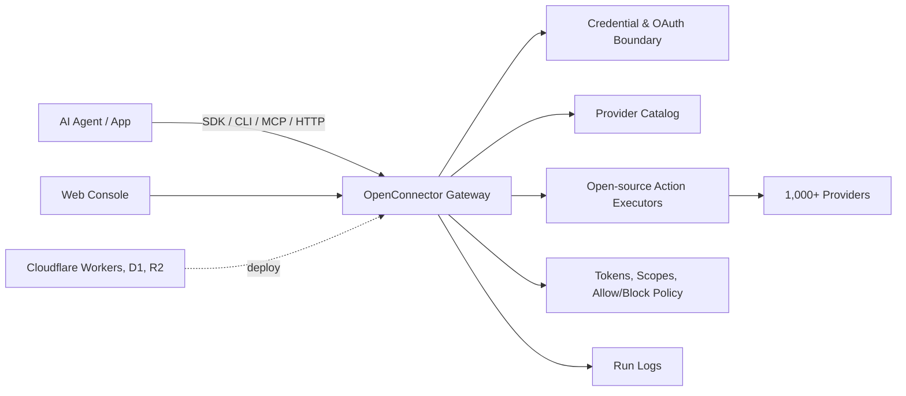

<div align="center">


[English](README.md) | [简体中文](docs/README.zh-CN.md) | [繁體中文](docs/README.zh-TW.md) | [日本語](docs/README.ja.md) | [Русский](docs/README.ru.md) | [Français](docs/README.fr.md)

[](LICENSE.txt)


[](https://oomol.com/apps)
[](https://oomol.com/apps)

</div>

OpenConnector is an open-source connector gateway for AI agents and an alternative to Composio.
Connect user app accounts once, then expose a shared catalog of 1,000+ providers and 10,000+
prebuilt Actions to agents and applications.

Use the [Connector SDK](https://github.com/oomol-lab/connector-sdk) from app code,
[oo CLI](https://github.com/oomol-lab/oo-cli) as the local-agent relay, MCP from agent hosts,
HTTP/OpenAPI from custom clients, and the Web Console for administration and debugging.

- Keep credentials, scopes, schemas, policies, and run logs inside an inspectable runtime.
- Run locally, on Fly.io, on Cloudflare-compatible infrastructure, or through OOMOL's hosted
  runtime.
- Use the same provider ids, Action ids, schemas, and contracts across open-source and commercial
  SaaS deployments.

## What It Provides

- A working connector catalog across products such as GitHub, Gmail, Notion, BigQuery, Google
  Analytics, Supabase, Airtable, Slack, and more.
- Credential handling for API keys, OAuth2, custom credentials, and no-auth providers.
- Inspectable Action contracts: request/response schemas, required scopes, and lazy-loaded executor
  source.
- Runtime controls for connection identity, scopes, runtime tokens, action allow/block policies,
  temporary file transit, and redacted run logs.
- Deployment options for local Docker or Node.js, Fly.io with persistent SQLite storage,
  Cloudflare Workers with D1/R2/Static Assets, and OOMOL's hosted runtime.

## Where It Fits

OpenConnector fits products where agents need durable access to the tools users already use, without
handing provider credentials to the agent process.

- Agent products that need reusable access across work apps, developer tools, data systems,
  communication platforms, and AI services.
- Products adding agent workflows that need stable, inspectable Action contracts for user app
  access.
- Teams that want hosted auth for speed while keeping a path to private or self-hosted runtime
  control.

## Developer Tools

| Tool                                                        | Purpose                                                                                                                                                                 |
| ----------------------------------------------------------- | ----------------------------------------------------------------------------------------------------------------------------------------------------------------------- |
| [Connector SDK](https://github.com/oomol-lab/connector-sdk) | Thin TypeScript HTTP client. Use `OpenConnector` for self-hosted runtimes, or `Connector` / `ProjectConnector` for OOMOL-hosted personal and SaaS end-user connections. |
| [oo CLI](https://github.com/oomol-lab/oo-cli)               | Local agent relay for connector Actions. `oo connector` can search, inspect, and run Actions against OOMOL-hosted or self-hosted OpenConnector runtimes.                |
| MCP                                                         | Expose app Actions to MCP-capable agent hosts through `http://localhost:3000/mcp`.                                                                                      |
| HTTP / OpenAPI                                              | Call `/v1/actions/*` directly or inspect the generated `/openapi.json` document.                                                                                        |

Endpoint details, response envelopes, auth headers, MCP tools, and Action guide examples are in
[docs/runtime-api.md](docs/runtime-api.md).

## Dashboard Preview

OpenConnector ships with a local Dashboard for browsing connectors, configuring credentials,
creating runtime tokens, and inspecting runtime usage.

### Connector Catalog

Use the connector catalog to see available services, search for providers, and open their Actions
and credential setup from one place.


### Usage Overview

Use the Overview page after deployment to monitor runtime readiness, available providers,
executable Actions, recent failures, tool call trends, and recent calls.


Provider names and trademarks belong to their respective owners and are used only for identification
and interoperability.

## How It Works



Apps and agents discover Actions, inspect schemas and scopes, select a connection alias, and execute
through the gateway. Provider secrets stay behind the runtime boundary; agents receive the metadata,
safe account labels, and execution results needed for the run.

## Usage Paths

| Path                         | Best for                                            | Includes                                                                                                                                                                  |
| ---------------------------- | --------------------------------------------------- | ------------------------------------------------------------------------------------------------------------------------------------------------------------------------- |
| Open-source self-host        | Developers and teams that want full control         | Local Docker or Node runtime, SQLite storage, MCP, HTTP, OpenAPI, and Web Console                                                                                         |
| Fly.io self-host             | Teams that want a hosted Docker runtime             | Node Docker runtime, SQLite storage on a Fly volume, TLS, health checks, MCP, HTTP, OpenAPI, and Web Console                                                              |
| Cloudflare-compatible deploy | Teams that want a lightweight hosted runtime        | Workers runtime, D1 state, R2 transit files, and Static Assets for the console                                                                                            |
| [OOMOL](https://oomol.com/)  | Teams blocked by OAuth approval or launch deadlines | Hosted auth and runtime infrastructure with the same provider and Action contracts; compatible with the open-source interface for later private or self-hosted deployment |

## Cloudflare Quick Start Video

[](https://www.youtube.com/watch?v=R0V1ZdCuTgc)

The
[Cloudflare Workers deployment walkthrough](https://www.youtube.com/watch?v=R0V1ZdCuTgc) shows how
to launch OpenConnector on Cloudflare with Workers, D1, R2, and the Web Console. The video follows
the same flow as [docs/cloudflare.md](docs/cloudflare.md): create Cloudflare resources, copy
`wrangler.example.jsonc` to `wrangler.local.jsonc`, apply D1 migrations, set required secrets, and
run `npm run deploy:cloudflare`.

## Quick Start

Start the runtime from the published image with Docker Compose:

```bash
docker compose up
```

This pulls `ghcr.io/oomol-lab/open-connector:latest`. To build from source instead:

```bash
docker compose -f docker-compose.yml -f docker-compose.build.yml up --build
```

Open the local console and generated API reference:

```text
http://localhost:3000
http://localhost:3000/docs
```

Run a no-auth Action to verify the runtime:

```bash
curl -s -X POST http://localhost:3000/v1/actions/hackernews.get_top_stories \
  -H 'content-type: application/json' \
  -d '{"input":{}}'
```

See [docs/quickstart.md](docs/quickstart.md) for the full local setup, first provider connection,
OAuth flow, and runtime settings.

## Connect a Provider

GitHub is the simplest credentialed example because it can use a personal access token:

```bash
curl -s -X PUT http://localhost:3000/api/connections/github \
  -H 'content-type: application/json' \
  -d '{"authType":"api_key","values":{"apiKey":"github_pat_..."}}'

curl -s -X POST http://localhost:3000/v1/actions/github.get_current_user \
  -H 'content-type: application/json' \
  -d '{"input":{}}'
```

For OAuth2 apps, named connections, credential encryption, token refresh, and action policies, see
[docs/credentials.md](docs/credentials.md) and [docs/configuration.md](docs/configuration.md).

## Web Console

For npm-based local development, open `http://localhost:5173`; the Web Console dev server proxies
API requests to the runtime on `http://localhost:3000`. For Docker or a built Node runtime, the
console is served from `http://localhost:3000`.

The console supports provider browsing, API key and OAuth client configuration, runtime token
creation, Action schema inspection, Action debugging, recent run review, and access to the
generated OpenAPI and MCP metadata.

## Cloudflare Deployment

OpenConnector can run on Cloudflare with Workers for the runtime, D1 for state, R2 for transit
files, and Static Assets for the Web Console.

See [docs/cloudflare.md](docs/cloudflare.md) for resource creation, migrations, secrets, local Worker
preview, and remote deployment.

## Fly.io Deployment

OpenConnector can also run on Fly.io with the Node Docker runtime and persistent SQLite storage on a
Fly volume.

See [docs/fly-io.md](docs/fly-io.md) for app creation, volume setup, secrets, deployment, custom
domains, and scaling.

## Docker Image (GHCR)

Run OpenConnector from a prebuilt image on GitHub Packages (GHCR): `ghcr.io/oomol-lab/open-connector`. Use
`latest` for the newest release, a pinned version like `v1.0.0` for production, or `tip` for the
latest `main` build.

See [docs/docker-ghcr.md](docs/docker-ghcr.md) for tags, pulling, and running.

## Want to Use It Directly?

The paths above are for teams integrating connectors into their own products, runtimes, or
infrastructure. If you want to try the SaaS connection experience first, or use it directly in
day-to-day work, you do not need to deploy OpenConnector or integrate the SDK, CLI, MCP, or HTTP API
first.

[Wanta](https://wanta.ai/) is the desktop product entry point using the same shared 1,000+
SaaS/provider coverage. Connect accounts once, then use natural language to search, organize,
create, and sync across connected tools.

| If You Want to                           | Wanta Provides                                                                                                                  |
| ---------------------------------------- | ------------------------------------------------------------------------------------------------------------------------------- |
| Try 1,000+ SaaS connections directly     | Use the same SaaS/provider coverage without deploying a runtime or integrating SDK/CLI first.                                   |
| Use Agents in daily work                 | Work across email, chat, docs, data, projects, support, developer tools, and marketing tools in natural language.               |
| Share connected capabilities with a team | Configure connections and access scopes once; teammates use them without setup while keys, tokens, and credentials stay hidden. |

## Documentation

- [Quickstart](docs/quickstart.md)
- [Developer tools](docs/sdk-cli.md)
- [Gmail OAuth and SDK tutorial](docs/gmail-oauth-sdk.md)
- [Runtime API and MCP](docs/runtime-api.md)
- [Fly.io deployment](docs/fly-io.md)
- [Cloudflare deployment](docs/cloudflare.md)
- [Docker image (GHCR)](docs/docker-ghcr.md)
- [Configuration](docs/configuration.md)
- [Credentials and OAuth](docs/credentials.md)
- [Catalog format](docs/catalog-format.md)
- [Verification language](docs/verification.md)
- [Contributing](CONTRIBUTING.md)
- [Code of Conduct](CODE_OF_CONDUCT.md)
- [Security](SECURITY.md)

## Development

Use Node.js 22 or newer:

```bash
npm install
npm run dev
```

The local API runtime listens on `http://localhost:3000`. The Web Console dev server listens on
`http://localhost:5173` and proxies API requests to the runtime.

Before opening a pull request:

```bash
npm run fix-check
npm test
```

Provider code lives under `src/providers/<service>`. See
[CONTRIBUTING.md](CONTRIBUTING.md#adding-providers) for provider contribution rules.

## License Scope

Unless otherwise noted, the source code, scripts, generated project scaffolding, tests, and
documentation authored for this repository are licensed under the Apache License, Version 2.0. See
[LICENSE.txt](LICENSE.txt).

The Apache-2.0 license for this repository does not grant rights to third-party products,
providers, apps, APIs, trademarks, service marks, trade names, logos, icons, brand assets,
documentation, screenshots, or other copyrighted materials owned by their respective holders.

Provider and app names, metadata, links, scopes, permissions, and optional logos/icons are included
only to identify services and enable interoperability. All third-party brand and product rights
remain with their respective owners. Inclusion in this catalog does not imply endorsement,
sponsorship, partnership, certification, or verification by those owners.

If you contribute provider metadata or assets, only submit material you have the right to submit.
Prefer linking to official public assets instead of copying brand files into this repository.

## Community

Please keep issues and pull requests focused, respectful, and actionable. Participation in this
project is governed by [CODE_OF_CONDUCT.md](CODE_OF_CONDUCT.md).
