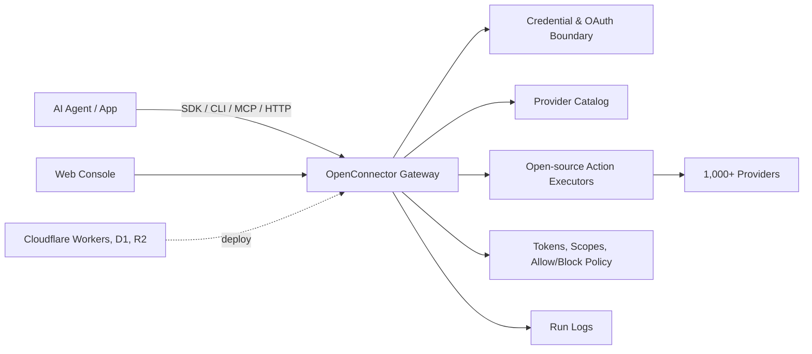

<div align="center">


[English](../README.md) | [简体中文](README.zh-CN.md) | [日本語](README.ja.md) | [Русский](README.ru.md) | [Français](README.fr.md)

[](../LICENSE.txt)


[](https://oomol.com/apps)
[](https://oomol.com/apps)

</div>

OpenConnector — open-source connector gateway для AI agents и альтернатива Composio. Подключите
пользовательские аккаунты приложений один раз, а затем откройте общий catalog из 1,000+ providers и
10 000+ готовых Actions для агентов и приложений.

В application code используйте [Connector SDK](https://github.com/oomol-lab/connector-sdk), для
local-agent relay — [oo CLI](https://github.com/oomol-lab/oo-cli), для agent hosts — MCP, для
custom clients — HTTP/OpenAPI, а для администрирования и отладки — локальную Web Console.

- Держите credentials, scopes, schemas, policies и run logs внутри проверяемого runtime.
- Запускайте локально, на Fly.io, в Cloudflare-совместимой инфраструктуре или через hosted runtime
  OOMOL.
- Используйте одни и те же provider ids, Action ids, schemas и contracts в open-source и
  commercial SaaS deployments.

## Что Дает

- Рабочий connector catalog для GitHub, Gmail, Notion, BigQuery, Google Analytics, Supabase,
  Airtable, Slack и других продуктов.
- Управление credentials в одном runtime: API keys, OAuth2, custom credentials и providers без
  аутентификации.
- Проверяемые и расширяемые Action contracts: request/response schemas, required scopes и
  lazy-loaded executor source.
- Runtime controls для production: connection identity, scopes, runtime tokens, action allow/block
  policies, временный транзит файлов и редактированные журналы запусков.
- Варианты развертывания через локальный Docker или Node.js, Fly.io с persistent SQLite storage,
  Cloudflare Workers / D1 / R2 / Static Assets и hosted runtime OOMOL.

## Где Это Уместно

OpenConnector подходит продуктам, где агентам нужен длительный доступ к инструментам пользователей
без передачи provider credentials в процесс агента.

- Агентские продукты, которым нужен переиспользуемый доступ к рабочим приложениям, инструментам
  разработчика, системам данных, коммуникационным платформам и AI-сервисам.
- Продукты, добавляющие agent workflows и нуждающиеся в стабильных, проверяемых Action contracts
  для доступа к пользовательским приложениям.
- Команды, которые хотят быстро стартовать с hosted auth и сохранить путь к private или self-hosted
  runtime control.

## Инструменты Разработчика

| Инструмент                                                  | Назначение                                                                                                                                                                    |
| ----------------------------------------------------------- | ----------------------------------------------------------------------------------------------------------------------------------------------------------------------------- |
| [Connector SDK](https://github.com/oomol-lab/connector-sdk) | Легкий TypeScript HTTP client. Для self-hosted runtime используйте `OpenConnector`, для OOMOL-hosted personal и SaaS end-user connections — `Connector` / `ProjectConnector`. |
| [oo CLI](https://github.com/oomol-lab/oo-cli)               | Connector Action relay для локальных агентов. `oo connector` может искать, проверять и запускать Actions в OOMOL-hosted или self-hosted OpenConnector runtime.                |
| MCP                                                         | Экспортировать app Actions в MCP-совместимые hosts агентов через `http://localhost:3000/mcp`.                                                                                 |
| HTTP / OpenAPI                                              | Вызывать `/v1/actions/*` напрямую или просматривать сгенерированный документ `/openapi.json`.                                                                                 |

Подробности об endpoints, response envelopes, auth headers, MCP tools и примерах Action guide см. в
[runtime-api.md](runtime-api.md).

## Обзор Dashboard

OpenConnector включает локальный Dashboard для просмотра connectors, настройки credentials,
создания runtime tokens и проверки runtime usage.

### Connector Catalog

В connector catalog можно просматривать доступные services, искать providers и открывать их Actions
и credential setup из одного места.


### Usage Overview

После развертывания страница Overview показывает runtime readiness, доступные providers,
исполняемые Actions, недавние failures, tool call trends и recent calls.


Названия и товарные знаки providers принадлежат их владельцам и используются только для
идентификации и совместимости.

## Как Это Работает



Приложения и агенты обнаруживают Actions, просматривают schemas и scopes, выбирают connection alias
и выполняют запросы через gateway. Provider secrets остаются за границей runtime; агенты получают
только metadata, безопасные account labels и результаты выполнения, необходимые для запуска.

## Пути Использования

| Путь                                 | Лучше всего подходит для                                | Включает                                                                                                                                                              |
| ------------------------------------ | ------------------------------------------------------- | --------------------------------------------------------------------------------------------------------------------------------------------------------------------- |
| Open-source self-host                | Разработчиков и команд, которым нужен полный контроль   | Локальный Docker или Node runtime, SQLite storage, MCP, HTTP, OpenAPI и Web Console                                                                                   |
| Fly.io self-host                     | Команд, которым нужен hosted Docker runtime             | Node Docker runtime, SQLite storage на Fly volume, TLS, health checks, MCP, HTTP, OpenAPI и Web Console                                                               |
| Cloudflare-совместимое развертывание | Команд, которым нужен легкий hosted runtime             | Workers runtime, состояние D1, транзитные файлы R2 и Static Assets для console                                                                                        |
| [OOMOL](https://oomol.com/)          | Команд, ограниченных OAuth approval или сроками запуска | Hosted auth и runtime infrastructure с теми же provider и Action contracts; совместимость с open-source interface для последующего private или self-hosted deployment |

## Видео Быстрого Старта Cloudflare

[](https://www.youtube.com/watch?v=R0V1ZdCuTgc)

[Пошаговое видео по развертыванию на Cloudflare Workers](https://www.youtube.com/watch?v=R0V1ZdCuTgc)
показывает, как запустить OpenConnector на Cloudflare с Workers, D1, R2 и Web Console. Видео
следует тому же процессу, что и [cloudflare.md](cloudflare.md): создать ресурсы Cloudflare,
скопировать `wrangler.example.jsonc` в `wrangler.local.jsonc`, применить D1 migrations, задать
обязательные secrets и выполнить `npm run deploy:cloudflare`.

## Быстрый Старт

Запустите runtime из опубликованного образа через Docker Compose:

```bash
docker compose up
```

Это скачает `ghcr.io/oomol-lab/open-connector:latest`. Чтобы собрать из исходников:

```bash
docker compose -f docker-compose.yml -f docker-compose.build.yml up --build
```

Откройте локальную console и сгенерированную API reference:

```text
http://localhost:3000
http://localhost:3000/docs
```

Выполните Action без аутентификации, чтобы проверить runtime:

```bash
curl -s -X POST http://localhost:3000/v1/actions/hackernews.get_top_stories \
  -H 'content-type: application/json' \
  -d '{"input":{}}'
```

Полную локальную настройку, первое provider connection, OAuth flow и runtime settings см. в
[quickstart.md](quickstart.md).

## Подключить Provider

GitHub — самый простой пример с credentials, потому что он может использовать personal access
token:

```bash
curl -s -X PUT http://localhost:3000/api/connections/github \
  -H 'content-type: application/json' \
  -d '{"authType":"api_key","values":{"apiKey":"github_pat_..."}}'

curl -s -X POST http://localhost:3000/v1/actions/github.get_current_user \
  -H 'content-type: application/json' \
  -d '{"input":{}}'
```

OAuth2 apps, named connections, credential encryption, token refresh и action policies описаны в
[credentials.md](credentials.md) и [configuration.md](configuration.md).

## Web Console

Откройте `http://localhost:3000` после запуска runtime. Console поддерживает просмотр providers,
настройку API key и OAuth client, создание runtime tokens, просмотр Action schemas, отладку
Actions, проверку недавних запусков и доступ к сгенерированным OpenAPI и MCP metadata.

## Развертывание Cloudflare

OpenConnector можно развернуть на Cloudflare: Workers запускает runtime, D1 хранит state, R2
обрабатывает transit files, а Static Assets обслуживает Web Console.

Создание ресурсов, migrations, secrets, локальная Worker preview и remote deployment описаны в
[cloudflare.md](cloudflare.md).

## Развертывание Fly.io

OpenConnector также можно развернуть на Fly.io с Node Docker runtime и persistent SQLite storage на
Fly volume.

Создание Fly app, настройка volume, secrets, deployment, custom domain и scaling описаны в
[fly-io.md](fly-io.md).

## Docker-образ (GHCR)

Запускайте OpenConnector из готового образа в GitHub Packages (GHCR): `ghcr.io/oomol-lab/open-connector`.
Используйте `latest` для новейшего release, закреплённую версию вроде `v1.0.0` для production или `tip`
для последнего build из `main`.

О тегах образа, pull и запуске см. [docker-ghcr.md (на английском)](docker-ghcr.md).

## Хотите Использовать Напрямую?

Пути выше предназначены для команд, которые интегрируют connector в свои продукты, runtimes или
enterprise infrastructure. Если вы хотите сначала попробовать SaaS connection experience или сразу
использовать это в работе, вам не обязательно сначала deploy OpenConnector или интегрировать SDK,
CLI, MCP либо HTTP API.

[Wanta](https://wanta.ai/) — desktop product entry point с тем же 1,000+ SaaS/provider coverage.
После подключения accounts можно через natural language искать, организовывать, создавать и
синхронизировать данные между connected tools.

| Если Вы Хотите                          | Что Дает Wanta                                                                                                          |
| --------------------------------------- | ----------------------------------------------------------------------------------------------------------------------- |
| Попробовать 1,000+ SaaS connections     | Использовать то же SaaS/provider coverage без runtime deploy или предварительной SDK/CLI integration.                   |
| Использовать Agents в ежедневной работе | Работать через natural language с email, chat, docs, data, projects, support, developer tools и marketing tools.        |
| Делиться подключенными capabilities     | Один раз настроить connections и access scopes; teammates используют их без setup, а keys, tokens и credentials скрыты. |

## Документация

- [Быстрый старт](quickstart.md)
- [Инструменты разработчика](sdk-cli.md)
- [Руководство Gmail OAuth и SDK (на английском)](gmail-oauth-sdk.md)
- [Runtime API и MCP](runtime-api.md)
- [Развертывание Fly.io](fly-io.md)
- [Развертывание Cloudflare](cloudflare.md)
- [Docker-образ (GHCR) (на английском)](docker-ghcr.md)
- [Configuration](configuration.md)
- [Credentials и OAuth](credentials.md)
- [Формат catalog](catalog-format.md)
- [Язык verification](verification.md)
- [Contributing](../CONTRIBUTING.md)
- [Code of Conduct](../CODE_OF_CONDUCT.md)
- [Security](../SECURITY.md)

## Разработка

Используйте Node.js 22 или новее:

```bash
npm install
npm run dev
```

Локальный API runtime слушает `http://localhost:3000`. Dev server Web Console слушает
`http://localhost:5173` и проксирует API requests в runtime.

Перед открытием pull request:

```bash
npm run fix-check
npm test
```

Provider code находится в `src/providers/<service>`. Правила добавления providers см. в
[CONTRIBUTING.md](../CONTRIBUTING.md#adding-providers).

## Область Действия Лицензии

Если не указано иное, исходный код, scripts, сгенерированное project scaffolding, tests и
documentation, созданные для этого repository, лицензируются по Apache License, Version 2.0. См.
[LICENSE.txt](../LICENSE.txt).

Лицензия Apache-2.0 для этого repository не предоставляет прав на third-party products, providers,
apps, APIs, trademarks, service marks, trade names, logos, icons, brand assets, documentation,
screenshots или другие copyrighted materials, принадлежащие соответствующим правообладателям.

Названия providers и apps, metadata, links, scopes, permissions и optional logos/icons включены
только для идентификации сервисов и обеспечения совместимости. Все права на third-party brands и
products остаются у их владельцев. Включение в этот catalog не означает одобрения, спонсорства,
партнерства, сертификации или проверки со стороны этих владельцев.

Если вы добавляете provider metadata или assets, отправляйте только материалы, на передачу которых
у вас есть права. Предпочитайте ссылки на официальные публичные assets вместо копирования brand
files в этот repository.

## Сообщество

Пожалуйста, делайте issues и pull requests сфокусированными, уважительными и пригодными к
исполнению. Участие в проекте регулируется [CODE_OF_CONDUCT.md](../CODE_OF_CONDUCT.md).
