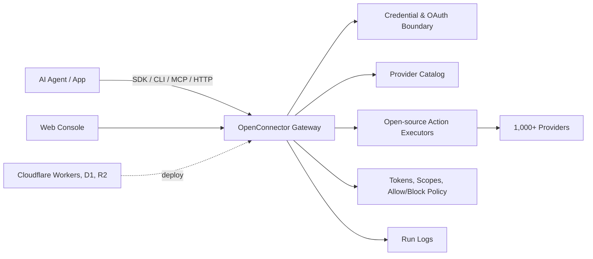

<div align="center">


[English](../README.md) | [简体中文](README.zh-CN.md) | [日本語](README.ja.md) | [Русский](README.ru.md) | [Français](README.fr.md)

[](../LICENSE.txt)


[](https://oomol.com/apps)
[](https://oomol.com/apps)

</div>

OpenConnector 是面向 AI Agent 的开源 connector gateway，也是 Composio 的开源替代方案。
连接一次用户应用账号，就可以把包含 1,000+ 个 provider 和 10,000+ 个预置 Action 的共享 catalog 暴露给
Agent 和应用。

应用代码使用 [Connector SDK](https://github.com/oomol-lab/connector-sdk)，本地 Agent 使用
[oo CLI](https://github.com/oomol-lab/oo-cli) 中继，Agent host 使用 MCP，自定义客户端使用
HTTP/OpenAPI；管理和调试使用本地 Web 控制台。

- 把 credential、scope、schema、policy 和运行日志保留在可检查的 runtime 里。
- 支持本地运行、Fly.io 部署、Cloudflare 兼容基础设施部署，也可以使用 OOMOL 托管 runtime。
- 开源版和商业 SaaS 版共享同一套 provider id、Action id、schema 和契约。

## 提供什么

- 一套可直接使用的 connector catalog，覆盖 GitHub、Gmail、Notion、BigQuery、Google Analytics、Supabase、Airtable、Slack
  等常见产品。
- 支持 API key、OAuth2、自定义凭据，以及无需鉴权的 provider。
- 可以审查和扩展的 Action 契约：请求/响应 schema、required scope 和按需加载的 executor 源码。
- 面向生产的 runtime 控制：connection identity、scope、runtime token、action allow/block policy、临时文件中转和脱敏运行日志。
- 部署方式覆盖本地 Docker 或 Node.js、Fly.io 持久化 SQLite、Cloudflare Workers/D1/R2/Static
  Assets，以及 OOMOL 托管 runtime。

## 适合什么场景

OpenConnector 适合需要让 Agent 持续访问用户现有工具、但不想把 provider credential 交给 Agent 进程的产品。

- 需要在工作应用、开发者工具、数据系统、沟通平台和 AI 服务之间复用接入层的 Agent 产品。
- 正在加入 Agent workflow，并希望通过稳定、可审查的 Action 契约接入用户应用的产品。
- 希望先用托管鉴权快速上线，同时保留未来私有化或自托管 runtime 控制权的团队。

## 开发者工具

| 工具                                                        | 用途                                                                                                                                              |
| ----------------------------------------------------------- | ------------------------------------------------------------------------------------------------------------------------------------------------- |
| [Connector SDK](https://github.com/oomol-lab/connector-sdk) | 轻量 TypeScript HTTP client。自托管 runtime 使用 `OpenConnector`，OOMOL 托管的个人连接和 SaaS 终端用户连接使用 `Connector` / `ProjectConnector`。 |
| [oo CLI](https://github.com/oomol-lab/oo-cli)               | 本地 Agent 的 connector Action 中继线。`oo connector` 可以搜索、查看和运行 OOMOL 托管或自托管 OpenConnector runtime 中的 Action。                 |
| MCP                                                         | 通过 `http://localhost:3000/mcp` 把应用 Action 暴露给支持 MCP 的 agent host。                                                                     |
| HTTP / OpenAPI                                              | 直接调用 `/v1/actions/*`，或查看生成的 `/openapi.json` 文档。                                                                                     |

Endpoint、response envelope、鉴权 header、MCP tools 和 Action guide 示例见
[runtime-api.md](runtime-api.md)。

## Dashboard 预览

OpenConnector 内置本地 Dashboard，可用于浏览 connector、配置 credential、创建 runtime token 和查看运行时使用数据。

### Connector 预览

通过 connector catalog 可以查看可用服务、搜索 provider，并进入对应的 Action 与 credential 配置。


### 数据统计概览

部署后，Overview 页面会集中展示运行时状态、可用 provider、可执行 Action、最近失败、工具调用趋势和最近调用记录。


Provider 名称和商标归各自权利人所有，本项目仅用于识别服务和实现互操作。

## 工作方式



应用或 Agent 可以发现 Action、查看 schema 和 scope、选择 connection alias，并通过网关执行调用。Provider
secret 保留在运行时边界内；Agent 拿到本次运行所需的 metadata、安全账号标签和执行结果。

## 使用路径

| 路径                        | 适合谁                                | 提供什么                                                                                                       |
| --------------------------- | ------------------------------------- | -------------------------------------------------------------------------------------------------------------- |
| 开源自托管                  | 希望完全掌控基础设施的开发者和团队    | 本地 Docker 或 Node runtime、SQLite 存储、MCP、HTTP、OpenAPI 和 Web 控制台                                     |
| Fly.io 自托管               | 希望使用托管 Docker runtime 的团队    | Node Docker runtime、Fly volume 上的 SQLite 存储、TLS、健康检查、MCP、HTTP、OpenAPI 和 Web 控制台              |
| Cloudflare 兼容部署         | 希望快速获得轻量托管运行时的团队      | Workers runtime、D1 状态存储、R2 文件中转和控制台 Static Assets                                                |
| [OOMOL](https://oomol.com/) | 被 OAuth 申请周期或上线时间卡住的团队 | 托管鉴权和运行时基础设施，使用同一套 provider 和 Action 契约；接口与开源版兼容，后续可迁移到私有化或自托管部署 |

## Cloudflare 快速启动视频

[](https://www.youtube.com/watch?v=R0V1ZdCuTgc)

[Cloudflare Workers 部署演示](https://www.youtube.com/watch?v=R0V1ZdCuTgc) 展示如何把
OpenConnector 跑到 Cloudflare 的 Workers、D1、R2 和 Web 控制台上。视频流程与
[cloudflare.md](cloudflare.md) 保持一致：创建 Cloudflare 资源、把
`wrangler.example.jsonc` 复制成 `wrangler.local.jsonc`、执行 D1 migration、设置必需
secret，然后运行 `npm run deploy:cloudflare`。

## 快速开始

使用 Docker Compose 从发布的镜像启动运行时：

```bash
docker compose up
```

这会拉取 `ghcr.io/oomol-lab/open-connector:latest`。想改为从源码构建：

```bash
docker compose -f docker-compose.yml -f docker-compose.build.yml up --build
```

打开本地控制台和生成的 API 文档：

```text
http://localhost:3000
http://localhost:3000/docs
```

运行一个不需要鉴权的 Action，确认运行时已经正常工作：

```bash
curl -s -X POST http://localhost:3000/v1/actions/hackernews.get_top_stories \
  -H 'content-type: application/json' \
  -d '{"input":{}}'
```

完整本地启动、第一个 provider 连接、OAuth flow 和运行时设置见 [quickstart.md](quickstart.md)。

## 连接 Provider

GitHub 是最简单的带凭据示例，因为它可以使用 personal access token：

```bash
curl -s -X PUT http://localhost:3000/api/connections/github \
  -H 'content-type: application/json' \
  -d '{"authType":"api_key","values":{"apiKey":"github_pat_..."}}'

curl -s -X POST http://localhost:3000/v1/actions/github.get_current_user \
  -H 'content-type: application/json' \
  -d '{"input":{}}'
```

OAuth2 应用、命名连接、凭据加密、token 刷新和 action policy 见
[credentials.md](credentials.md) 与 [configuration.md](configuration.md)。

## Web 控制台

启动运行时后打开 `http://localhost:3000`。控制台支持浏览 provider、保存 API key 或 OAuth client
配置、创建 runtime token、查看 Action schema、调试 Action、查看最近运行记录，并打开生成的 OpenAPI 和
MCP metadata。

## Cloudflare 部署

OpenConnector 可以部署到 Cloudflare：Workers 运行 runtime，D1 保存状态，R2 处理中转文件，Static
Assets 承载 Web 控制台。

Cloudflare 资源创建、migration、secret、本地 Worker preview 和远程部署步骤见
[cloudflare.md](cloudflare.md)。

## Fly.io 部署

OpenConnector 也可以部署到 Fly.io：使用 Node Docker runtime，并把 SQLite 数据持久化到 Fly volume。

Fly app 创建、volume、secret、部署、自定义域名和扩缩容步骤见 [fly-io.md](fly-io.md)。

## Docker 镜像（GHCR）

可以直接用 GitHub Packages（GHCR）上的预构建镜像运行 OpenConnector：`ghcr.io/oomol-lab/open-connector`。最新
release 用 `latest`，生产环境固定版本号（如 `v1.0.0`），想用最新 `main` 构建则用 `tip`。

镜像标签、拉取和运行的说明见 [docker-ghcr.zh-CN.md](docker-ghcr.zh-CN.md)。

## 不想先接入？可以直接使用 Wanta

上面的路径更适合把 connector 接入自己的产品、runtime 或企业基础设施。如果你只是想先体验连接各种
SaaS 的效果，或者想直接在业务中使用这些能力，不一定要先部署 OpenConnector，也不一定要接入 SDK、CLI、MCP 或
HTTP API。

[Wanta](https://wanta.ai/) 是使用同一套 1,000+ SaaS/provider 覆盖的桌面端产品入口。用户连接账号后，就可以用自然语言让 AI
跨已连接工具查询、整理、生成和同步。

| 如果你想要             | Wanta 提供                                                                               |
| ---------------------- | ---------------------------------------------------------------------------------------- |
| 直接体验 SaaS 连接能力 | 使用同一套 1,000+ SaaS/provider 覆盖，不需要先部署 runtime 或接入 SDK/CLI。              |
| 直接在业务中使用       | 用自然语言跨邮件、沟通、文档、数据、项目、客服、开发和营销等工具查询、整理、生成和同步。 |
| 团队一起使用           | 一人配置连接和授权范围，成员免配置使用；Key、Token 和账号凭据不外露。                    |

## 文档

- [快速开始](quickstart.md)
- [开发者工具](sdk-cli.md)
- [Gmail OAuth 和 SDK 接入教程](gmail-oauth-sdk.zh-CN.md)
- [Runtime API 和 MCP](runtime-api.md)
- [Fly.io 部署](fly-io.md)
- [Cloudflare 部署](cloudflare.md)
- [Docker 镜像（GHCR）](docker-ghcr.zh-CN.md)
- [配置项](configuration.md)
- [凭据和 OAuth](credentials.md)
- [Catalog 格式](catalog-format.md)
- [Verification 语言](verification.md)
- [贡献指南](../CONTRIBUTING.md)
- [行为准则](../CODE_OF_CONDUCT.md)
- [安全政策](../SECURITY.md)

## 开发

请使用 Node.js 22 或更新版本：

```bash
npm install
npm run dev
```

本地 API runtime 监听 `http://localhost:3000`。Web Console 开发服务器监听
`http://localhost:5173`，并把 API 请求代理到 runtime。

打开 pull request 前运行：

```bash
npm run fix-check
npm test
```

Provider 代码位于 `src/providers/<service>`。Provider 贡献规则见
[CONTRIBUTING.md](../CONTRIBUTING.md#adding-providers)。

## 许可证范围

除非另有说明，本仓库中的源代码、脚本、生成的项目脚手架、测试和文档均基于 Apache License, Version
2.0 授权。见 [LICENSE.txt](../LICENSE.txt)。

本仓库的 Apache-2.0 许可证不授予任何第三方产品、provider、app、API、商标、服务标识、商号、logo、
icon、品牌资产、文档、截图或其它归属于相应权利人的版权材料的使用权。

Provider 和 app 名称、metadata、链接、scope、permission 以及可选 logo/icon 仅用于识别服务和实现互操作。
所有第三方品牌和产品权利仍归各自权利人所有。本 catalog 中出现某个服务不代表其权利人对本项目的认可、赞助、合作、认证或验证。

如果你贡献 provider metadata 或资产，请只提交你有权提交的材料。优先链接到官方公开资产，而不是把品牌文件复制到本仓库。

## 社区

请让 issue 和 pull request 保持聚焦、尊重且可执行。参与本项目需遵守 [CODE_OF_CONDUCT.md](../CODE_OF_CONDUCT.md)。
