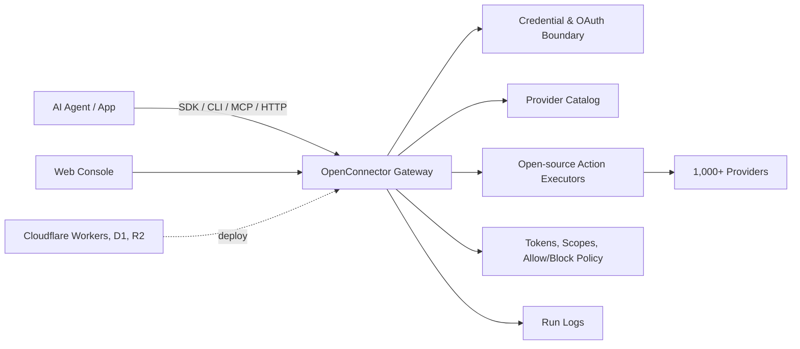

<div align="center">


[English](../README.md) | [简体中文](README.zh-CN.md) | [繁體中文](README.zh-TW.md) | [日本語](README.ja.md) | [Русский](README.ru.md) | [Français](README.fr.md)

[](../LICENSE.txt)


[](https://oomol.com/apps)
[](https://oomol.com/apps)

</div>

OpenConnector 是一套供 AI Agent 使用的開放原始碼連接器閘道，也是 Composio 的替代方案。
只要連線一次使用者的應用程式帳號，就能向 Agent 與應用程式提供共用目錄，其中包含 1,000 多個服務提供者及 10,000 多個預先建置的 Action。

在應用程式程式碼中使用 [Connector SDK](https://github.com/oomol-lab/connector-sdk)，以
[oo CLI](https://github.com/oomol-lab/oo-cli) 作為本機 Agent 的轉接工具；Agent 主機可使用 MCP，
自訂用戶端可使用 HTTP/OpenAPI，而 Web 控制台則用於管理與偵錯。

- 將憑證、權限範圍、結構描述、原則及執行記錄保留在可檢視的執行階段中。
- 可在本機、Fly.io、Cloudflare 相容基礎架構，或 OOMOL 的代管執行階段上運作。
- 開放原始碼與商業 SaaS 部署共用相同的服務提供者 ID、Action ID、結構描述及合約。

## 提供的功能

- 可直接使用的連接器目錄，涵蓋 GitHub、Gmail、Notion、BigQuery、Google Analytics、Supabase、Airtable、Slack 等產品。
- 支援 API 金鑰、OAuth2、自訂憑證，以及無須驗證的服務提供者。
- 可檢視的 Action 合約：請求與回應結構描述、必要權限範圍，以及延遲載入的執行器原始碼。
- 執行階段控制功能，涵蓋連線身分、權限範圍、執行階段權杖、Action 允許/封鎖原則、暫存檔案傳輸及遮蔽敏感資料的執行記錄。
- 部署選項包括本機 Docker 或 Node.js、使用持久化 SQLite 儲存空間的 Fly.io、搭配 D1/R2/Static Assets 的 Cloudflare Workers，以及 OOMOL 的代管執行階段。

## 適用情境

OpenConnector 適合需要讓 Agent 長期存取使用者既有工具，又不想將服務提供者憑證交給 Agent 程序的產品。

- 需要在工作應用程式、開發者工具、資料系統、通訊平台及 AI 服務間重複使用存取層的 Agent 產品。
- 正在加入 Agent 工作流程，且需要以穩定、可檢視的 Action 合約存取使用者應用程式的產品。
- 想先透過代管驗證快速上線，同時保留日後改用私有或自行代管執行階段控制權的團隊。

## 開發者工具

| 工具                                                        | 用途                                                                                                                                                   |
| ----------------------------------------------------------- | ------------------------------------------------------------------------------------------------------------------------------------------------------ |
| [Connector SDK](https://github.com/oomol-lab/connector-sdk) | 輕量的 TypeScript HTTP 用戶端。自行代管的執行階段使用 `OpenConnector`；OOMOL 代管的個人及 SaaS 終端使用者連線則使用 `Connector` / `ProjectConnector`。 |
| [oo CLI](https://github.com/oomol-lab/oo-cli)               | 本機 Agent 的連接器 Action 轉接工具。`oo connector` 可在 OOMOL 代管或自行代管的 OpenConnector 執行階段中搜尋、檢視及執行 Action。                      |
| MCP                                                         | 透過 `http://localhost:3000/mcp` 向支援 MCP 的 Agent 主機提供應用程式 Action。                                                                         |
| HTTP / OpenAPI                                              | 直接呼叫 `/v1/actions/*`，或檢視產生的 `/openapi.json` 文件。                                                                                          |

端點詳細資料、回應封裝格式、驗證標頭、MCP 工具及 Action 指南範例，請參閱
[runtime-api.md](runtime-api.md)。

## 儀表板預覽

OpenConnector 內附本機儀表板，可用來瀏覽連接器、設定憑證、建立執行階段權杖及檢視執行階段使用情形。

### 連接器目錄

透過連接器目錄，可在同一處查看可用服務、搜尋服務提供者，並開啟其 Action 與憑證設定。


### 使用情形總覽

部署後可透過「總覽」頁面監控執行階段就緒狀態、可用服務提供者、可執行的 Action、近期失敗、工具呼叫趨勢及近期呼叫。


服務提供者名稱與商標均屬各自權利人所有，本專案僅將其用於識別服務及實現互通性。

## 運作方式



應用程式與 Agent 可探索 Action、檢視結構描述與權限範圍、選取連線別名，並透過閘道執行呼叫。
服務提供者密鑰會保留在執行階段邊界內；Agent 只會取得該次執行所需的中繼資料、安全的帳號標籤及執行結果。

## 使用方式

| 方式                        | 適用對象                          | 內容                                                                                                                 |
| --------------------------- | --------------------------------- | -------------------------------------------------------------------------------------------------------------------- |
| 開放原始碼、自行代管        | 想完整掌控基礎架構的開發者與團隊  | 本機 Docker 或 Node 執行階段、SQLite 儲存空間、MCP、HTTP、OpenAPI 及 Web 控制台                                      |
| Fly.io 自行代管             | 想使用代管 Docker 執行階段的團隊  | Node Docker 執行階段、Fly volume 上的 SQLite 儲存空間、TLS、健康檢查、MCP、HTTP、OpenAPI 及 Web 控制台               |
| Cloudflare 相容部署         | 想要輕量代管執行階段的團隊        | Workers 執行階段、D1 狀態、R2 傳輸檔案及控制台的 Static Assets                                                       |
| [OOMOL](https://oomol.com/) | 受限於 OAuth 核准或上線期限的團隊 | 使用相同服務提供者與 Action 合約的代管驗證及執行階段基礎架構；介面與開放原始碼版本相容，日後可改用私有或自行代管部署 |

## Cloudflare 快速入門影片

[](https://www.youtube.com/watch?v=R0V1ZdCuTgc)

[Cloudflare Workers 部署操作示範](https://www.youtube.com/watch?v=R0V1ZdCuTgc)說明如何使用 Workers、D1、R2 及 Web 控制台，
在 Cloudflare 上啟動 OpenConnector。影片流程與 [cloudflare.md](cloudflare.md) 相同：建立 Cloudflare 資源、將
`wrangler.example.jsonc` 複製為 `wrangler.local.jsonc`、套用 D1 移轉、設定必要密鑰，最後執行
`npm run deploy:cloudflare`。

## 快速開始

使用 Docker Compose 從已發布的映像檔啟動執行階段：

```bash
docker compose up
```

此指令會拉取 `ghcr.io/oomol-lab/open-connector:latest`。若要改為從原始碼建置：

```bash
docker compose -f docker-compose.yml -f docker-compose.build.yml up --build
```

開啟本機控制台與產生的 API 參考文件：

```text
http://localhost:3000
http://localhost:3000/docs
```

執行一個無須驗證的 Action，以確認執行階段正常運作：

```bash
curl -s -X POST http://localhost:3000/v1/actions/hackernews.get_top_stories \
  -H 'content-type: application/json' \
  -d '{"input":{}}'
```

完整的本機設定、第一個服務提供者連線、OAuth 流程及執行階段設定，請參閱 [quickstart.md](quickstart.md)。

## 連線服務提供者

GitHub 是最簡單的憑證範例，因為它可以使用 Personal Access Token：

```bash
curl -s -X PUT http://localhost:3000/api/connections/github \
  -H 'content-type: application/json' \
  -d '{"authType":"api_key","values":{"apiKey":"github_pat_..."}}'

curl -s -X POST http://localhost:3000/v1/actions/github.get_current_user \
  -H 'content-type: application/json' \
  -d '{"input":{}}'
```

OAuth2 應用程式、具名連線、憑證加密、權杖更新及 Action 原則，請參閱
[credentials.md](credentials.md) 與 [configuration.md](configuration.md)。

## Web 控制台

使用 npm 在本機開發時，請開啟 `http://localhost:5173`；Web 控制台開發伺服器會將 API 請求轉送至
`http://localhost:3000` 上的執行階段。使用 Docker 或已建置的 Node 執行階段時，控制台由
`http://localhost:3000` 提供。

控制台支援瀏覽服務提供者、設定 API 金鑰與 OAuth 用戶端、建立執行階段權杖、檢視 Action 結構描述、
偵錯 Action、查看近期執行記錄，以及存取產生的 OpenAPI 與 MCP 中繼資料。

## Cloudflare 部署

OpenConnector 可部署至 Cloudflare：Workers 負責執行階段、D1 儲存狀態、R2 處理傳輸檔案，Static Assets 則提供 Web 控制台。

資源建立、移轉、密鑰、本機 Worker 預覽及遠端部署方式，請參閱 [cloudflare.md](cloudflare.md)。

## Fly.io 部署

OpenConnector 也可部署至 Fly.io，使用 Node Docker 執行階段，並將 SQLite 資料持久儲存在 Fly volume 上。

應用程式建立、volume 設定、密鑰、部署、自訂網域及擴充方式，請參閱 [fly-io.md](fly-io.md)。

## Docker 映像檔（GHCR）

使用 GitHub Packages（GHCR）上的預先建置映像檔執行 OpenConnector：`ghcr.io/oomol-lab/open-connector`。
最新版本使用 `latest`；正式環境請固定版本號，例如 `v1.0.0`；若要使用最新的 `main` 建置則使用 `tip`。

標籤、拉取及執行方式，請參閱 [docker-ghcr.md（英文）](docker-ghcr.md)。

## 想直接使用？

上述方式適合將連接器整合進自有產品、執行階段或基礎架構的團隊。如果只想先體驗 SaaS 連線，
或直接用於日常工作，不必先部署 OpenConnector，也不必先整合 SDK、CLI、MCP 或 HTTP API。

[Wanta](https://wanta.ai/) 是使用相同 1,000 多項 SaaS/服務提供者涵蓋範圍的桌面產品入口。
帳號只需連線一次，就能用自然語言在已連線的工具間搜尋、整理、建立及同步內容。

| 如果你想要                    | Wanta 提供                                                                         |
| ----------------------------- | ---------------------------------------------------------------------------------- |
| 直接體驗 1,000 多項 SaaS 連線 | 使用相同的 SaaS/服務提供者涵蓋範圍，不必先部署執行階段或整合 SDK/CLI。             |
| 在日常工作中使用 Agent        | 以自然語言操作電子郵件、聊天、文件、資料、專案、客服、開發者工具及行銷工具。       |
| 與團隊共用已連線的功能        | 連線與存取範圍只需設定一次；團隊成員無須設定即可使用，而金鑰、權杖及憑證不會外露。 |

## 文件

- [快速入門](quickstart.md)
- [開發者工具](sdk-cli.md)
- [Gmail OAuth 與 SDK 教學（英文）](gmail-oauth-sdk.md)
- [執行階段 API 與 MCP](runtime-api.md)
- [Fly.io 部署](fly-io.md)
- [Cloudflare 部署](cloudflare.md)
- [Docker 映像檔（GHCR）（英文）](docker-ghcr.md)
- [設定](configuration.md)
- [憑證與 OAuth](credentials.md)
- [目錄格式](catalog-format.md)
- [驗證用語](verification.md)
- [貢獻指南](../CONTRIBUTING.md)
- [行為準則](../CODE_OF_CONDUCT.md)
- [安全性](../SECURITY.md)

## 開發

請使用 Node.js 22 或更新版本：

```bash
npm install
npm run dev
```

本機 API 執行階段監聽 `http://localhost:3000`。Web 控制台開發伺服器監聽
`http://localhost:5173`，並將 API 請求轉送至執行階段。

建立 Pull Request 前，請執行：

```bash
npm run fix-check
npm test
```

服務提供者程式碼位於 `src/providers/<service>`。貢獻服務提供者的規則，請參閱
[CONTRIBUTING.md](../CONTRIBUTING.md#adding-providers)。

## 授權範圍

除非另有說明，本儲存庫中由專案作者撰寫的原始碼、指令碼、產生的專案鷹架、測試及文件，
均依 Apache License, Version 2.0 授權。請參閱 [LICENSE.txt](../LICENSE.txt)。

本儲存庫的 Apache-2.0 授權並未授予任何第三方產品、服務提供者、應用程式、API、商標、服務標章、
商號、標誌、圖示、品牌資產、文件、螢幕擷取畫面，或其他由其權利人擁有之著作權資料的使用權。

服務提供者及應用程式名稱、中繼資料、連結、權限範圍、權限，以及選用的標誌或圖示，僅用於識別服務及實現互通性。
所有第三方品牌與產品權利仍歸各自權利人所有。收錄於本目錄不代表該權利人認可、贊助、合作、認證或驗證本專案。

若要貢獻服務提供者中繼資料或資產，請只提交你有權提交的內容。請優先連結官方公開資產，不要將品牌檔案複製到本儲存庫。

## 社群

請確保 Issue 與 Pull Request 主題明確、尊重他人且可採取行動。參與本專案須遵守
[CODE_OF_CONDUCT.md](../CODE_OF_CONDUCT.md)。
